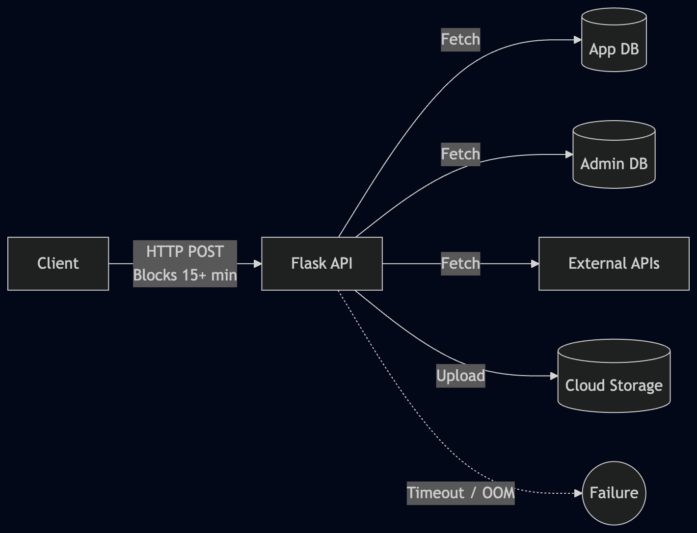
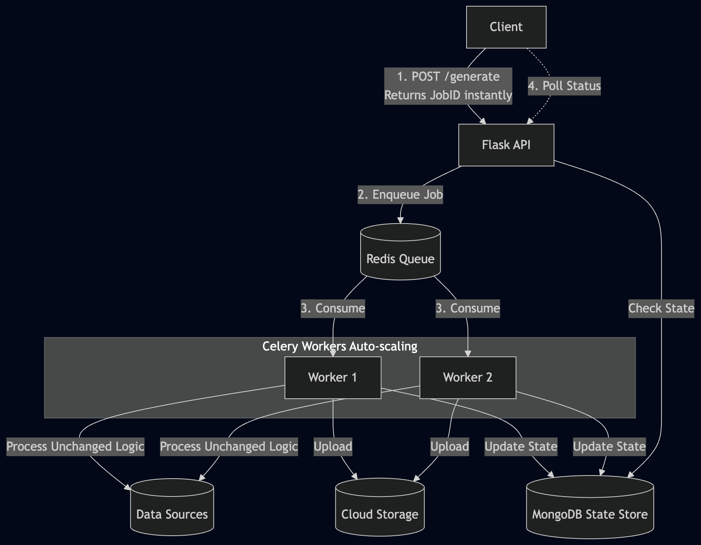
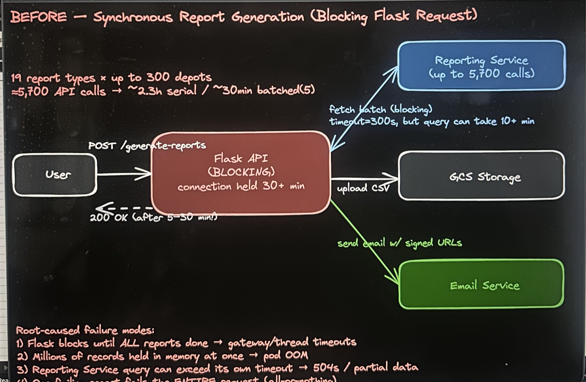
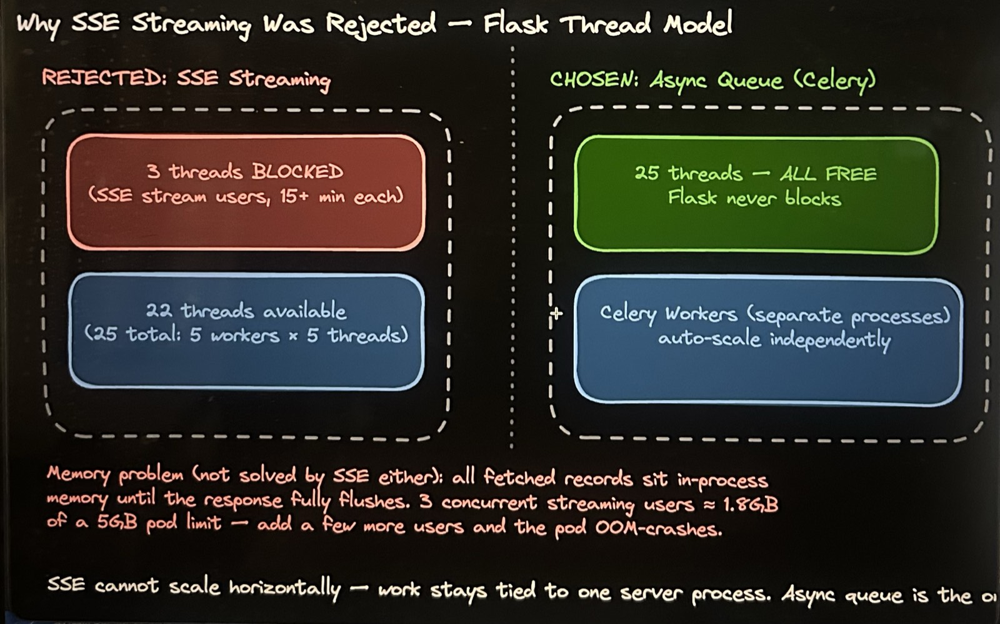
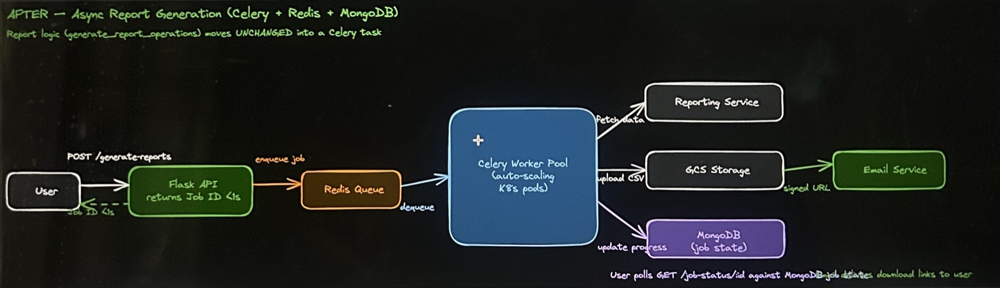
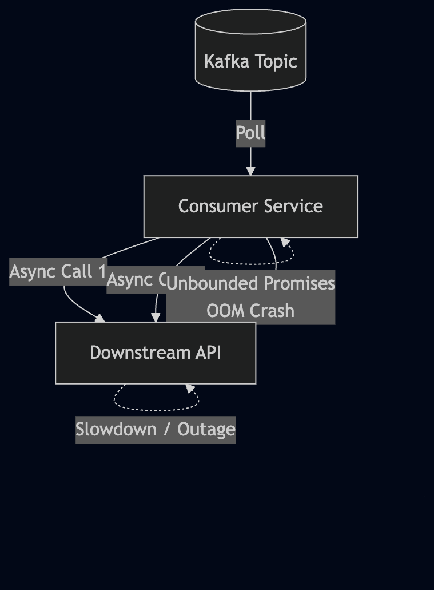
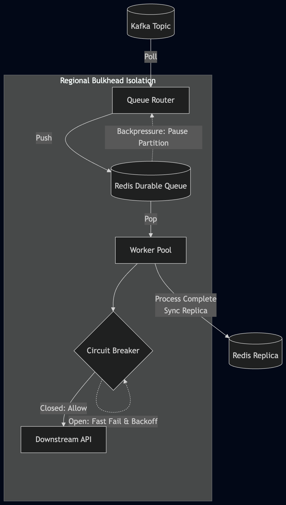
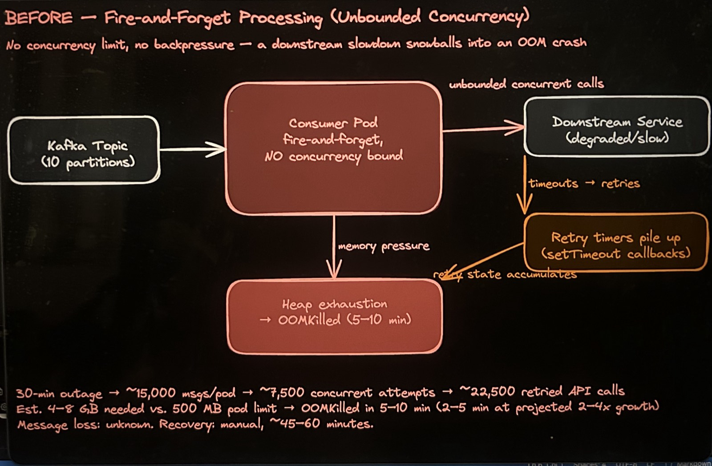
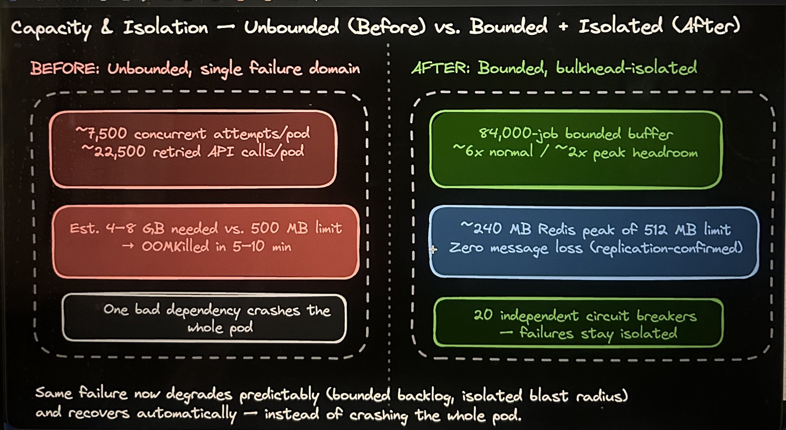
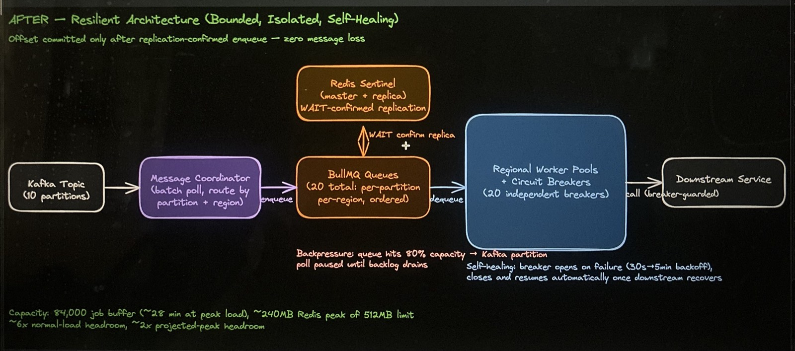

# System Architecture & RFCs

As a Lead Backend Engineer, my role often involves moving beyond implementation to drive the overall system design. Below are sanitized overviews of architectural decisions and RFCs I have authored to solve complex challenges in distributed environments. 

*Note: The details below have been abstracted to focus on the architectural patterns, trade-offs, and technical design rather than specific business logic or confidential company data.*

---

<h3>Rearchitecting a Reporting Pipeline for Reliability at Scale</h3>
Architecture RFC

**The Challenge**
The platform's report generation ran entirely inside a single blocking HTTP request. Collecting scope, calling downstream APIs in batches, transforming data, uploading to cloud storage, and emailing signed links all happened synchronously. At scale (19 report types × up to 300 sites ≈ 5,700 downstream API calls), this produced 30+ minute blocked connections, gateway timeouts, OOM crashes, and all-or-nothing failures, leading to a 91.3% overall success rate.

**Investigation & Patterns Evaluated**
I diagnosed six distinct architectural failure modes from production data. Before proposing the final design, I evaluated the simplest possible fix — keeping it synchronous but streaming progress via Server-Sent Events (SSE). 
- **Server-Sent Events (SSE) (Rejected):** Quantified analysis showed this would lead to severe thread exhaustion (each concurrent user permanently pins a thread for 15+ mins) and memory accumulation (fetched records sit in-process until the response fully flushes). It also failed to scale horizontally.
- **Async Job Queue (Chosen):** Decoupling report generation from the request lifecycle using an async job queue (Celery + Redis + MongoDB).

**Before & After Architecture**

*Before: Synchronous Bottleneck*

*After: Asynchronous Decoupling*

**The Solution & Trade-offs**
We decoupled report generation into an async Celery/Redis job queue. The exact same reporting function moved, **unmodified**, into a Celery task to minimize risk. Job state is tracked in MongoDB. 
- **Trade-off:** We traded a larger immediate rewrite (offloading report logic entirely into the downstream services) for a staged migration plan. The queue stabilizes the system first, setting up a clean path to incrementally migrate report types later.
- **Result:** Targeted a jump from 91.3% to 99.9% reliability. Response times went from 5–30 minutes of blocking wait to receiving a Job ID in <1 second. Blast radius of bugs became isolated to individual workers, allowing partial successes instead of all-or-nothing failures.

**Additional Info**

---

<h3>Building a Resilient Event-Driven Consumer That Stops Cascading Failures</h3>
Architecture RFC
<!-- Design — under review -->

**The Challenge**
A high-throughput Kafka consumer (Node.js) processed messages using a "fire-and-forget" model — launching unbounded concurrent async work per message with no backpressure and no concurrency limits. When a downstream service degraded, the consumer's retries and in-flight promises multiplied until the process ran out of memory and crashed. This risked message loss on every incident and required manual intervention to recover.

**Investigation & Patterns Evaluated**
I modeled the event loop and memory behavior under failure to understand the root cause. The analysis revealed that each message created a promise chain; failed calls spawned retry timers, filling the microtask queue with thousands of pending callbacks while the garbage collector failed to keep up. 
- **Simple Retry Limit (Rejected):** A naive retry-limit or timeout doesn't solve the lack of backpressure or the lack of isolation between independent message groups. A slowdown in one group would still consume all shared capacity and crash processing for everyone.
- **Multi-layered Resilience (Chosen):** A complete architecture re-design introducing circuit breakers, regional bulkhead isolation, Redis-backed backpressure queues, and transactional offset commits.

**Before & After Architecture**

*Before: Unbounded Fire-and-Forget*

*After: Multi-layered Resilience & Backpressure*

**The Solution & Trade-offs**
Messages are routed from Kafka into per-partition, per-region queues (backed by Redis), preserving strict in-order delivery. Independent worker pools and circuit breakers run per region, ensuring a failure in one region doesn't crash others (Bulkhead pattern). Each queue pauses its Kafka partition once it reaches 80% capacity (Backpressure).
- **Trade-off:** We traded operational simplicity for robust durability and isolation. The Kafka offset is committed *only after* the message is confirmed replicated to a Redis replica, guaranteeing zero message loss at the cost of slight latency overhead.
- **Result:** Eliminated unbounded concurrency. The system now degrades predictably, self-heals via circuit breaker backoffs without manual intervention, and is sized to handle projected 2–4x future growth without OOM crashing.

**Additional Info**

  10,000+ EV chargers
  14.4 M messages / day
  20 circuit breakers
  MTTR: 60 min → &lt; 5 min
  0 offset gaps / day

<a href="/portfolio-resilient-charging-consumer" style="font-weight:600;color:var(--vp-c-brand-1);">Read the full deep-dive — architecture diagram, four-layer breakdown, tradeoffs →</a>

